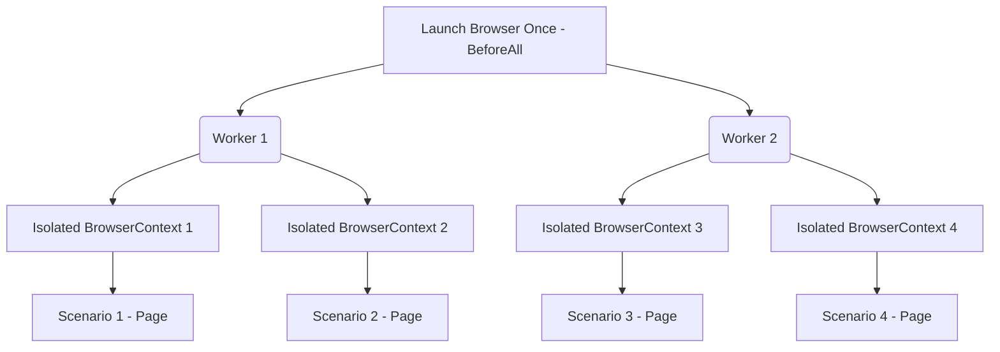

# Playwright + Cucumber Framework: Enterprise Scaling Feedback & Maintenance Plan

This document delivers **honest, production-ready, and architecturally deep scaling feedback** followed by a structured **Maintenance Plan** to make this framework the absolute benchmark ("best'est") for enterprise BDD and Agentic (AI-assisted) test automation.

---

## 1. Deep-Dive Scaling Feedback

While the framework possesses a stellar design system (`BasePage`, `UIUtils`, `ActionLogStore`, POM separation, and structured AI agent prompts), running hundreds of tests in a high-concurrency enterprise pipeline will introduce systemic bottlenecks. Below is an exhaustive breakdown of the architectural friction points and how to refactor them for scale.

### A. The Test Data Bottleneck: Excel (`ExcelHelper.js`)
* **The Scale Problem**: The framework currently reads an Excel workbook (`TestData.xlsx`) synchronously/from disk every time a step definitions requests a row (e.g., `this.excelHelper.readRow(...)`). 
  - **I/O Overhead**: In a suite of 500 scenarios running in parallel, parsing heavy binary `.xlsx` files hundreds of times creates severe disk I/O bottlenecks and memory bloat.
  - **Dynamic Collisions**: Excel sheets are difficult to merge in Git, leading to constant merge conflicts when multiple QA engineers update data.
  - **Lack of Type-Safety**: Excel cell formats can silently coerce numbers to floats, dates to unparsed strings, or null values to empty strings.
* **The Scaled Solution**:
  - **Data Caching**: Implement an in-memory cache inside `ExcelHelper` so that a workbook is loaded into memory exactly *once* per thread and reused across scenarios.
  - **Hybrid Data Layer**: Transition static test data (like system constants, configurations, and environment endpoints) into environment-specific JSON or `.ts` / `.js` files. Reserves Excel purely for business-driven spreadsheet data if stakeholders mandate it.
  - **Data Seeding**: Transition from pre-baked static data rows to **API-driven test data generation** inside Cucumber's `Before` hook. This ensures every test scenario creates its own isolated, unique entity instead of sharing a fragile `StandardUser` row that is prone to state collisions.

### B. Execution Concurrency & Browser Isolation (`world.js`)
* **The Scale Problem**: `CustomWorld.js` currently starts and stops a complete browser instance (`this.browser = await launch.launch(...)`) for **every single scenario** in `Before` / `After` hooks.
  - **Spin-up Latency**: Launching a browser process takes 1–2 seconds. In a suite of 300 tests, this adds **5 to 10 minutes** of pure browser bootstrap overhead.
  - **Parallelization Constraints**: The framework does not currently enforce worker shard configurations or separate temp directory structures for the user profiles, which can lead to file lock collisions during high-concurrency runs on a single CI machine.
* **The Scaled Solution**:
  - **Shared Browser / Isolated Contexts**: Refactor `world.js` so that a single **Browser** instance is launched *once* per worker process (using Cucumber's `BeforeAll` and `AfterAll` hooks), while every individual scenario spawns an isolated **BrowserContext** and **Page**. This drops scenario setup overhead from ~2000ms to ~100ms.
  - **Playwright Native Parallelism**: Integrate worker-safe execution directories so that log files, trace files, and screenshots are appended with `process.env.CUCUMBER_WORKER_ID` to prevent parallel threads from overwriting each other's outputs.

### C. Logging & Custom Reporter Bottleneck (`ActionLogStore.js`)
* **The Scale Problem**: `ActionLogStore` records every low-level micro-action (clicks, scrolls, types) in a global in-memory array and flushes them to disk at the end of each scenario. 
  - **Memory Leaks**: For very long, multi-step end-to-end user journeys (e.g., checkout flows with multiple APIs), this in-memory list will consume massive heaps.
  - **Traceability Fragmentation**: Custom JSON action logs are great for simple debugs, but they are detached from the standard **Playwright Trace Viewer**, making it hard to align a failed step with actual DOM snapshots and network calls in a single UI window.
* **The Scaled Solution**:
  - **Playwright Tracing Integration**: Configure `BrowserContext` to start Playwright Tracing (`context.tracing.start()`) for failing tests. 
  - **Buffered Flushing**: Stream action logs continuously to a append-only log file rather than holding the entire array in memory until scenario completion.
  - **Allure or ReportPortal Integration**: Standardize reporting into a centralized test orchestration portal (like Allure, ReportPortal, or Playwright's native HTML reporter compiled with Cucumber JSON) to provide interactive, searchable dashboards for team leads.

### D. BDD Step Cleanliness & Global Scope
* **The Scale Problem**: Cucumber step definitions are globally scoped. As demonstrated by the recent ambiguous step mapping error (`Then the user should be navigated to the inventory page`), different QA engineers will inevitably write identical phrasing with different locator assertions.
* **The Scaled Solution**:
  - **Strict Naming Conventions**: Enforce that step definitions must *only* contain highly reusable, generalized assertions (e.g., `Then the "Inventory Page" page is visible`) where the page class handles the locator resolution dynamically based on context.
  - **Base Assertions Step Class**: Create a dedicated `common.steps.js` step library for cross-cutting interactions (waiting, clicking generic links, verifying titles) to prevent duplicate bindings.

---

## 2. Agentic AI Scalability (.github/agents)

The presence of `.github/agents` and `.github/prompts` is an outstanding engineering decision that elevates this framework above 99% of modern QA setups. To scale this for multiple concurrent AI agents:

1. **Context Window Optimization**: AI agents lose accuracy when forced to ingest giant codebases. Keep locator modules highly modularized. Introduce index files or automated prompt templates that only supply the agent with the locators and pages relevant to the specific user story it is automation-engineering.
2. **Deterministic MCP Safety Boundaries**: In `.github/agents/framework-automation-generator.agent.md`, the rules successfully warn agents not to invent fake scripts or mock LLM plans. To improve this, integrate a pre-commit hook that validates generated step-definitions against existing cucumber step regexes to block duplicate step declarations before code review.
3. **Automated Locator Auditing**: Create an automated task for the agent to periodically run structural audits comparing locator keys in `src/locators/` with page objects in `src/pages/` to flag dead, unused selectors.

---

## 3. Core Maintenance Plan

To transform this repository into a bulletproof, "best-in-class" platform, execute the following staged structural maintenance program over the next three development sprints.

### Phase 1: Context Isolation & Concurrency Refactoring (Sprint 1)


1. **Optimize Browser Lifecycles**:
   - Refactor `world.js` to utilize a shared browser instance per thread.
   - Enable Playwright tracing programmatically when a test scenario is flagged with an `@debug` tag or fails in CI.
2. **Base URL Resolution**:
   - Ensure all relative navigation inputs are safely handled by configuring `baseURL: AppConfig.baseUrl` inside `browser.newContext()` directly.
3. **Worker Safety**:
   - Update file names in `ActionLogStore` and `ScreenshotUtils` to append `process.env.CUCUMBER_WORKER_ID` to make them instantly thread-safe.

### Phase 2: Test Data & Step Reusability Standard (Sprint 2)
1. **Excel Caching**:
   - Modify `ExcelHelper.js` to cache workbook objects in memory, reading each file only once per test runner run:
     ```javascript
     class ExcelHelper {
       static cache = new Map();
       // ... Check cache before calling workbook.xlsx.readFile
     }
     ```
2. **Introduce Common Steps**:
   - Create `features/step-definitions/common.steps.js` to isolate boilerplate actions, ensuring feature-specific step files stay 100% clean.
3. **Automated Linter and Formatting Rules**:
   - Equip the codebase with strict ESLint Rules to ensure that selectors are **never** hardcoded outside `src/locators/`.

### Phase 3: Enterprise Reporting & Observability (Sprint 3)
1. **Trace Viewer Integration**:
   - Archive full `.zip` Playwright traces on failure under `src/reports/traces/` and embed links to open these directly in the Playwright trace viewer in your custom HTML reporter.
2. **Unified Action Logging**:
   - Build a minor plugin that parses `action-logs/*.json` post-run to output a streamlined performance graph, pointing out exactly which step (e.g., checkout API, login form submission) has the highest response latency.

---

## 4. Continuous Integration (CI) Strategy

To maintain this framework in its elite state, integrate the following pipeline workflow:

```text
    Developer / Agent PR
            │
            ▼
    [Git Hook: Linter & Step Duplicate Check]
            │
            ▼
    [GitHub Actions / GitLab CI]
      ├── 1. Run eslint & check locator imports
      ├── 2. Spin up Playwright MCP / Headless Workers
      ├── 3. Execute Cucumber tests in Parallel (workers: 4)
      └── 4. Compile Action Logs + Playwright HTML Report
            │
            ▼
    [Publish HTML Summary to GH Pages / Slack notification]
```

By transitioning to **shared-browser/isolated-contexts**, implementing **Excel test data caching**, and establishing **unified step libraries**, your framework will effortlessly scale from a simple SauceDemo POC to a core enterprise-wide test engine handling thousands of scenarios per night with absolute stability.
